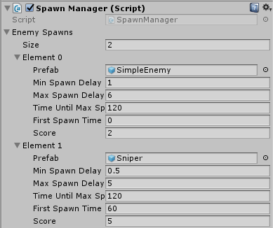

**Basic Scripting Lab**

**Information only relevant to artists will be in blue**

**Information only relevant to programmers will be in red**

**Information relevant to all will be in black**

In this lab we will be taking a surface level look at scripting by adding a new enemy type to a minigame. No actual coding will be involved.

First off select the *Main* scene from the *Project* tab. You should see a purple square on a black background

Now hit play and see how the game currently plays. You should see red circles coming towards you. If you get hit once you die.

Dying in one hit isn’t very fun! Let’s figure out how to fix that!

**Opening a script**

Scripts are found in the *Project* tab under *Assets. *Navigate to the *Player* folder and inside you should see a script called *Health*

Double click the script to open it. (This sometimes takes a while)

It is good practice to keep all your variable definitions at the top of the class and provide a brief comment explaining what it does. Some variable protection level explanations to get you started:

* <b>Private</b>- This is default and means no other script can access it, not even children

* <b>Public</b> - All scripts can access this variable **AND it shows up as a field in the inspector when this script is attached to an object**

    * If you need a variable to be public that should NOT show in the inspector write "**[HideInInspector]**" (no quotes) before or on the line above

* <b>Protected</b> - Child scripts can access this but no other scripts can

As an artist you probably won’t be editing scripts much if at all but it can be useful to know the basics. Towards the top of the file you should see a handful of comments. Read through them. The image below contains everything you would need to read in the script

So now we all know about public variables, but how can we change them? You can change them within the script but this will only affect future objects that use this script, what about the ones already using it? 

    Each object that has a Health script attached to it will have its own copy of the variables within (unless they are static variables). Setting the value of a public variable in the script is merely just setting its "default" value for when a script is first added to an object    

The better way to modify these public variables is through the inspector. So lets exit out of this script and go back to Unity. Now we can change our starting health to something other than one. 

To do this select the* Player* object in the hierarchy. In the *Inspector* look for the component titled *Health (Script)* You should see that it has one modifiable field "Starting Health." Change this from a 1 to a 3

**Prefabs**

A *Prefab* is essentially a *GameObject* that you save as a *Resource* / *Asse*t (like a script or character art). To create a* prefab* you can either right click in the *Project* window and select *Create > Prefab* or you can simply drag an existing *GameObject *from the *Hierarchy* tab into the *Project* window. 

Once you have a *Prefab* you can repeatedly drag it into the scene to create copies of the object. Try doing this with the *SimpleEnemy* *prefab*. You will notice a few things:

* The color in the hierarchy changed and the names are followed by a number

* When you select one of these objects there are new buttons at the top. These are used to keep the different prefab copies in sync. Hitting apply will apply the changes to all copies. Revert will undo any changes on this copy. Select just shows you the prefab

**Creating the new enemy type**

Delete all but one of the *SimpleEnemy ***hierarchy** objects **(DON’T DELETE THE PREFAB)**. We will use this last *SimpleEnemy* to create a new enemy type!

First we need to create a new prefab by right clicking in the *Assets* folder of the *Project* tab. Then selecting *Create > Prefab*. Give it the name "Sniper"

Next drag the *SimpleEnemy *from the hierarchy tab into the prefab you just created. This will break the link with the *SimpleEnemy Prefab* and now we are free to change things without messing up the original enemy type. 

Here is a list of things you should change:

* Change the color of the *SpriteRenderer* component to whatever you’d like

* Remove the *Simple Enemy Movement (Script)* component

    * Click the gear on the top right of the component

* Click *Add Component* and search for "Sniper Movement"

    * I have found a speed of 16 and a spawn distance of 10 works well

**Adding Sniper to the spawn manager**

Select the *SpawnManager *object from the *Hierarchy *tab. Edit the *SpawnManager (Script)* component to be as follows:

* Expand *Enemy Spawn* by clicking the arrow on the left

* Change size from 1 to 2

* Expand *Element 1* by clicking the arrow on the left

* Drag the *Sniper Prefab* you created onto the *Prefab* variable

* Set the remaining variables as follows:

For a more detailed description of the variables check the script for the comments

**Additional reading for Programmers:**

Artists see checkoff below

Take a look at SpawnManager.cs . This script combines a few things to make the Inspector for the script more useful. While there are much more complicated ways to modify what the inspector of a script is capable of these are going to be the most useful for you:

* [HideInInspector] Use this when you don’t want the inspector to show a variable but you still need it to be public (like in a struct)

* Structs - Use these to create convenient groupings of variable names that will stay grouped even in the inspector

    * The [System.Serializable] is required for the struct to show up in the inspector. Google this if you are interested in why. 

* Arrays/Lists - Use these to make adding new things to your game easier. Instead of having to add a new public variable for each enemy type you can add a new enemy entirely in the inspector!

Take a look at the relationship between *EnemyMovement.cs SimpleEnemyMovement.cs *and *SniperEnemyMovement.cs .* This is a good example of how to utilize *Inheritance* as in 61b.

* The protected keyword comes in handy here

* Functions that you plan on overriding need to be visible to the child (public or protected) as well as meant to be overriden (virtual or abstract)

* When a child class overrides a method you need to use the keyword *override* 

* When you override a method it is good practice to call the parent method by using "base.methodName()" *base* refers to the parent class

* Note that we separated Player and Enemy movement entirely because there wasn’t really much shared between them in our case

Note how *Health.cs *and *Attack.cs* interact. This is a good example of how to utilize *Composition* which should be a pretty new concept in coding here.

* When an object with an *Attack* script comes into contact with another object it will check to see if that object has a *Health* script and if it does it will call that script’s *takeDamage()* function.

* *Composition* is this idea of building up behaviors through modular components. An enemy has a movement script and an attack script. These two scripts together make up the behavior of an enemy. In *Inheritance *you build unique things up by adding new features to a parent class, from the top down. In *Composition* you build unique things from the bottom up by assembling different pieces together to get a desired behavior.

* Most games will probably utilize a mix of *Composition* and *Inheritance*. If the abundance of keywords required for *Inheritance *is incredibly daunting and confusing for you, fear not because you can get by on almost entirely *Composition* here

**Checkoff:**

* For checkoff make the Sniper enemy spawn at 10 seconds (change *First Spawn Time* from 60 to 10)

* The original enemy should still exist and be spawning

* The Sniper should have a unique color

* The Sniper should have a movement pattern different than the regular enemies

* The Player should be able to be hit more than one time before dying

    * Watch out for the clump of enemies following the player, they will do a lot more than 1 damage
